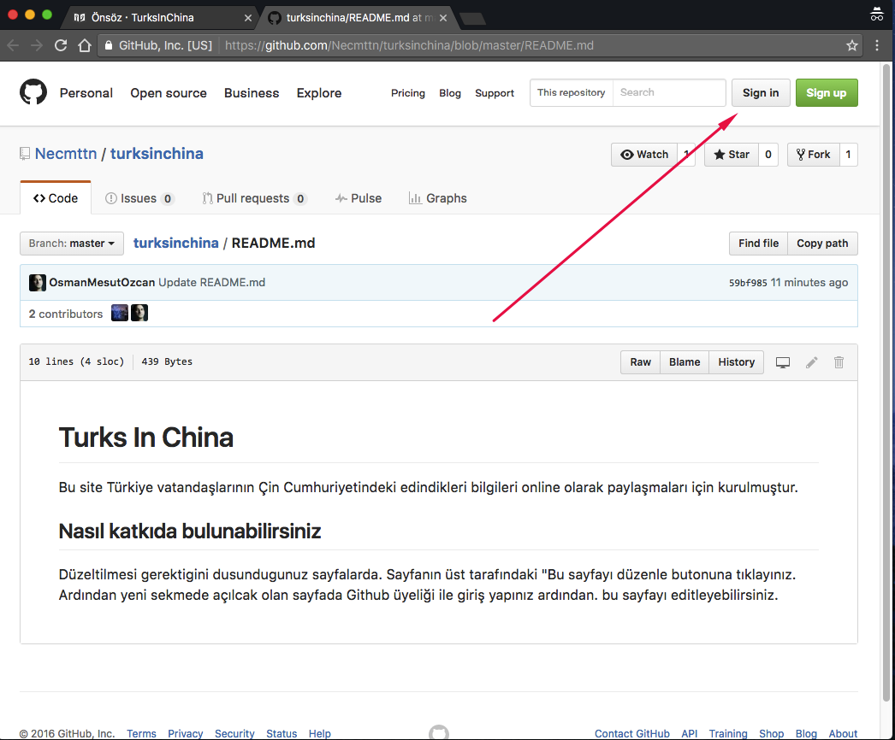
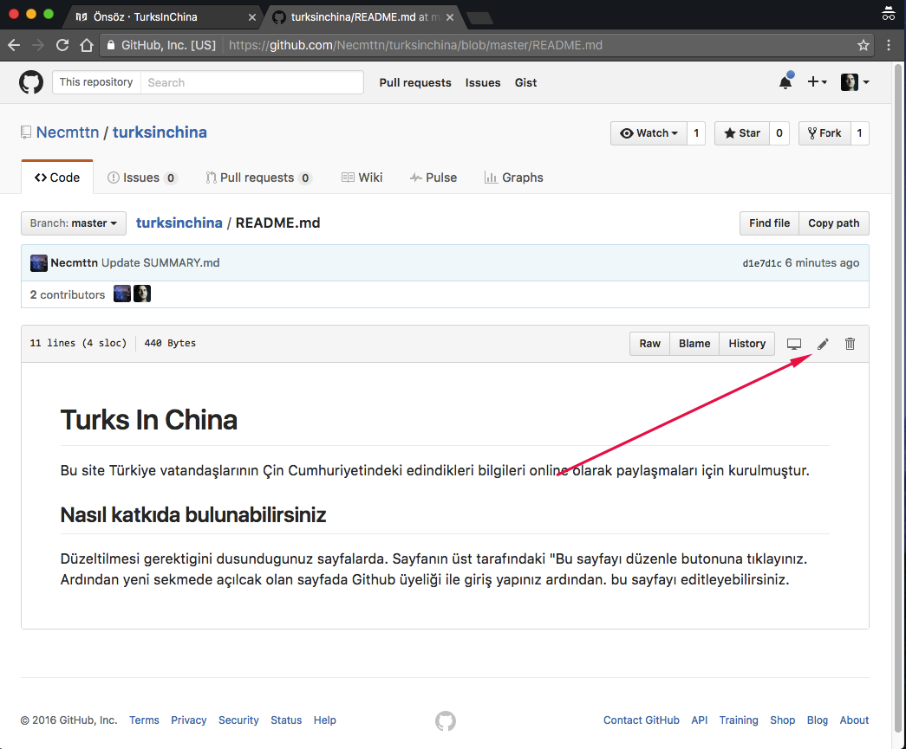
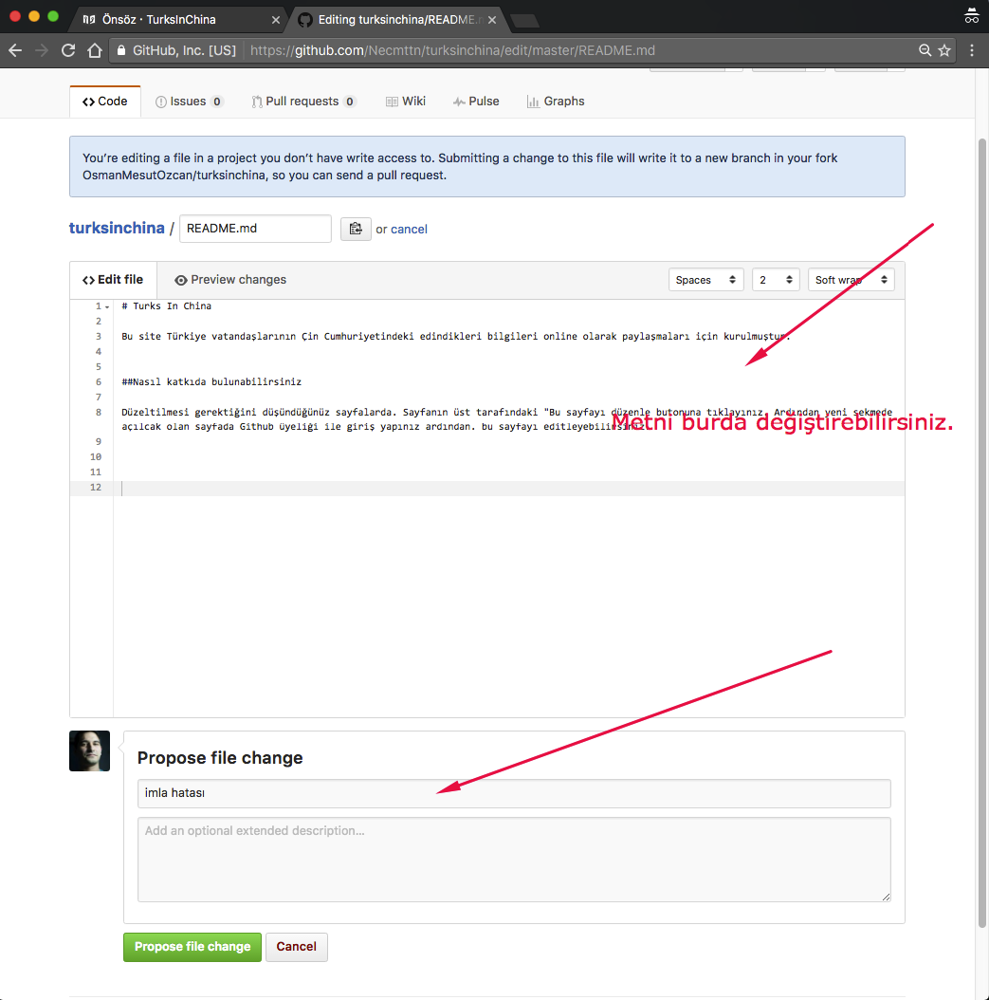
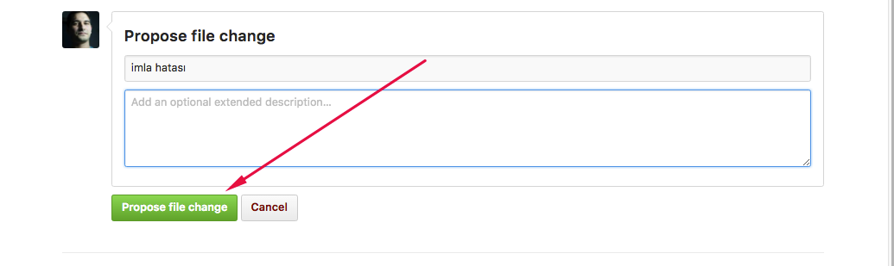
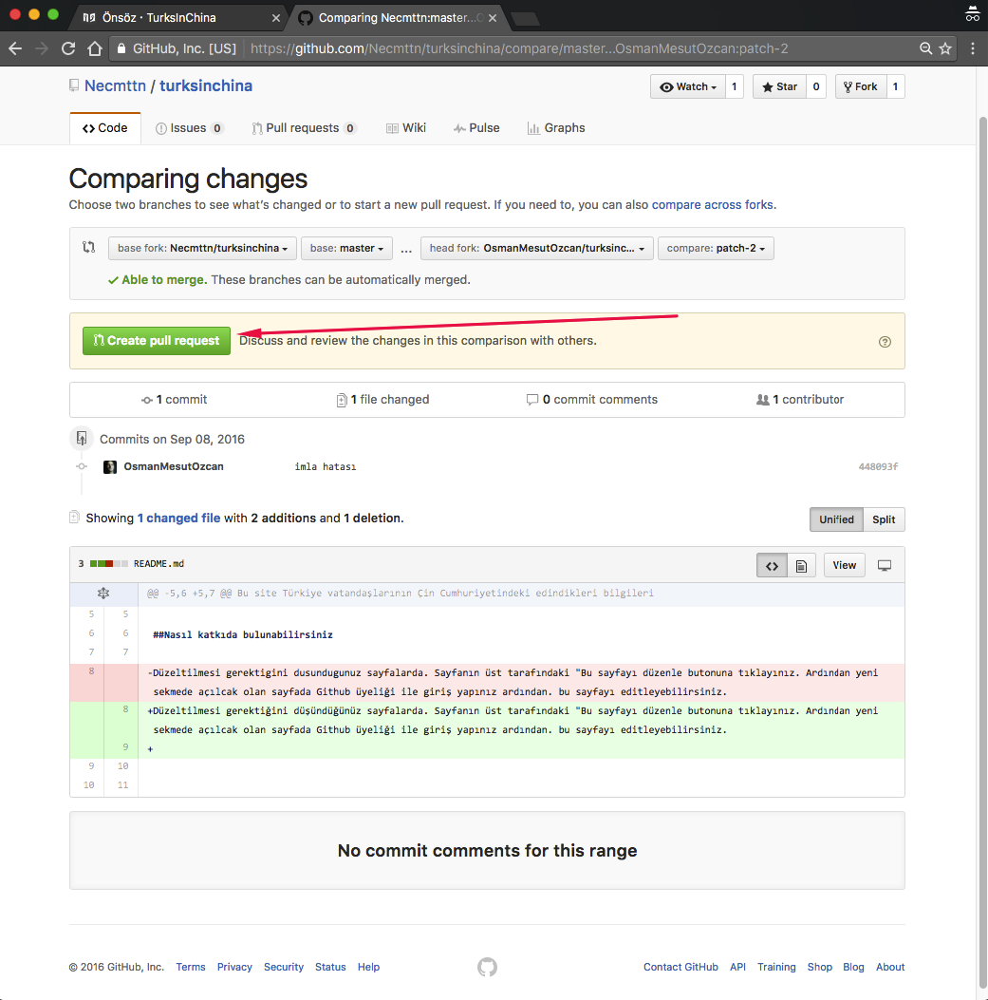
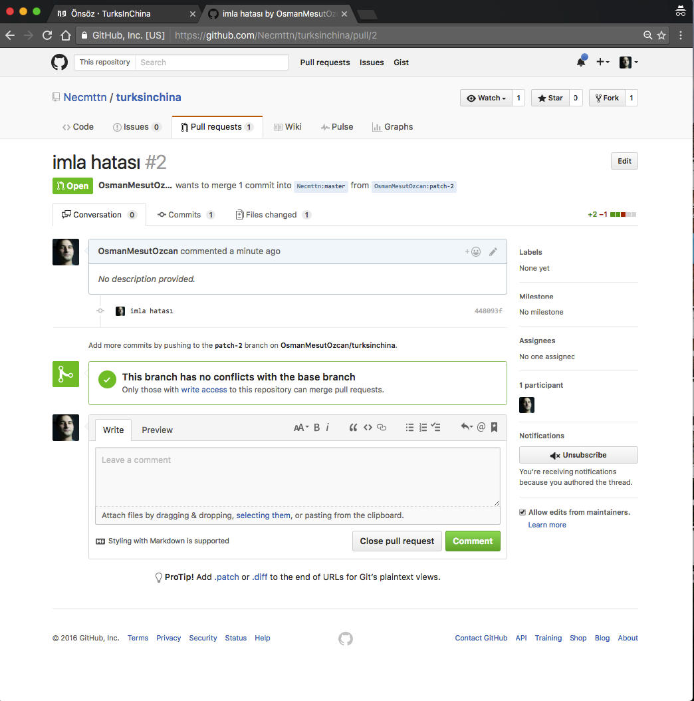

#Nasıl katkıda bulunabilirsiniz
Düzeltilmesi gerektigini dusundugunuz sayfalarda. Sayfanın üst tarafındaki "Bu sayfayı düzenle butonuna tıklayınız. Ardından yeni sekmede açılcak olan sayfada Github üyeliği ile giriş yapınız.

Eger uyeliginiz yok ise "Sign Up" butonu ile cok kısa sürede üyelik alabilirsiniz. 

Giriş yaptıktan sonra ;

"edit" butonuna basarak sayfayı düzenliyebilirsiniz.

Kullandığımız platform "Markdown" kullanmaktadır. 

##Markdown Nedir?

Bir web sitesinde yayınlanacak bir yazı yazmaya çalışırken bazı düzenlemeler yapmamız gerekir. HTML , bir yayın formatı olduğu için hızlı düzenlemeler yapmak zordur. Yayınlanacak yazıyı önce bir editör yardımıyla düzenleyip son halini HTML’ e çevirdikten sonra yayınlarız.

Markdown bize düz yazı yazarken aslında formatlı bir biçimde yazmayı sağlar.Böylelikle bir yazıyı daha sonradan HTML’e dönüştürebilir biçimde hızlıca düzenleyebiliriz.

##Markdown Nasıl Kullanılır?

Sayfayı düzenlemeyi bitirdikten sonra

Propose file change buttonuna tıklayarak editleme işlemini tamamlayabilirsiniz.

Ardından açılan sayfada yaptığınız değişiklikleri görebilirsiniz. Eğer herhangi bir sıkıntı görmüyorsanız. "Create pull request" butonuna tıklayarak. Editör arkadaşlara sayfanın değiştirme talebi gönderebilirsiniz.

Talebi gönderdiğinizde böyle bir sayfa karşınıza çıkıcaktır. 

Bundan sonrası editör arkadaşlar yaptığınız değişiklikleri inceleyip eğer bir sorun yok ise orjinal metni değiştirceklerdir.

Katkıda bulunduğunuz için **teşekkürler.**
